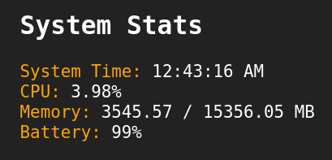

# System Monitor

A simple, real-time system resource monitor built with ASP.NET Core and a lightweight frontend.

## Features
* **System Time:** Current local time.
* **CPU Usage:** Real-time percentage display.
* **Memory Usage:** Current vs Max RAM usage in MB.
* **Battery Status:** Percentage remaining (if available).



## How to run
1.  **Run** the application:
    ```bash
    dotnet run --project src/SystemMonitor.csproj
    ```
2.  **Open** your browser and navigate to:
    `http://localhost:5000`

## API Endpoints
* `GET /stats`: Returns system statistics in JSON format.
